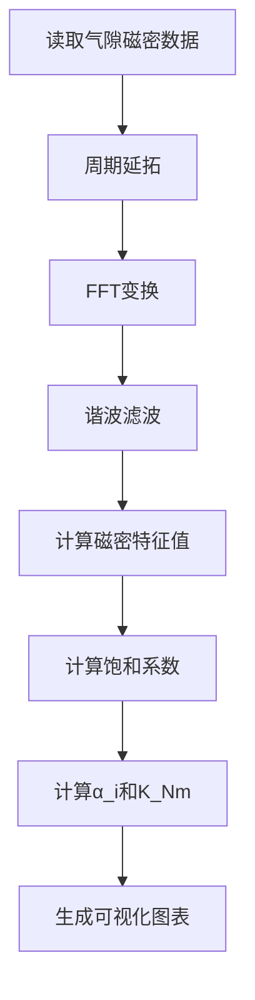
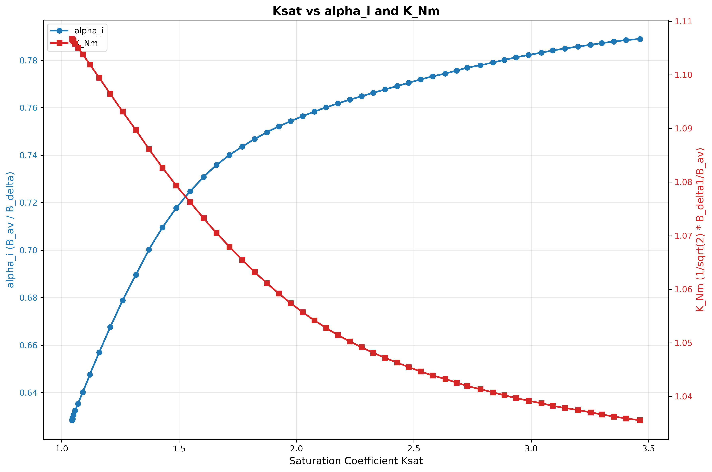
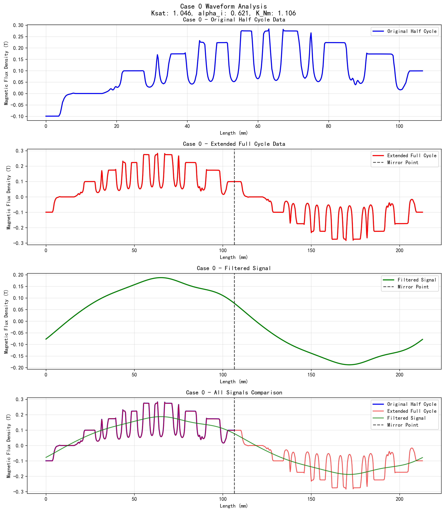

# 感应电机饱和系数计算项目

## 简介

通过分析气隙磁密数据、读取磁路中的磁场强度，计算感应电机饱和系数 **K_sat** 对计算极弧系数 **α_i'** 和波形系数 **K_Nm** 的曲线关系。

## 主要功能

### 1. 饱和系数计算
- **K_sat = 1 + (H_m,dr × 23.6 + H_m,ds × 27) / (H_m,delta × 0.4)**
- 其中：
  - H_m,dr：转子齿部磁场强度
  - H_m,ds：定子齿部磁场强度  
  - H_m,delta：气隙磁场强度
  - 23.6：转子齿高
  - 27：定子齿高
  - 0.4：气隙长度

### 2. 极弧系数计算
- **α_i = B_av / B_delta**
- 其中：
  - B_av：完整周期绝对值平均磁密
  - B_delta：滤波后磁密幅值

### 3. 波形系数计算
- **K_Nm = (1/√2) × (B_delta1 / B_av)**
- 其中：
  - B_delta1：FFT基波幅值

## 项目结构

```
├── README.md                    # 项目说明文档
├── data_processor.py           # 核心数据处理模块
├── simple_visualization.py     # 简化版可视化
├── waveform_visualization.py   # 波形详细分析可视化
├── calculated_results.csv    # 计算结果数据
├── ksat_alpha_knm.png         # K_sat与α_i、K_Nm关系曲线图
├── waveform_case_0.png        # 案例波形分析图
└── prmtric.1/                 # 输入数据目录
    ├── case.0/
    │   ├── output.txt         # 磁场强度参数
    │   └── airgapflux.csv     # 气隙磁密数据
    ├── case.1/
    └── ...
```

## 核心功能

### 气隙磁密处理
1. **周期延拓**：将半周期数据通过反射延拓为完整周期
2. **FFT分析**：提取基波分量和高次谐波
3. **谐波滤波**：保留低次谐波，消除高频噪声
4. **参数计算**：计算各种磁密特征值

### 数据流程


## 使用方法

### 1. 环境准备
```bash
pip install pandas numpy matplotlib
```

### 2. 数据处理
```python
from data_processor import DataProcessor

# 创建处理器实例
processor = DataProcessor()

# 处理所有案例数据（使用5次谐波滤波）
processor.process_all_cases(harmonic_filter_n=5)

# 保存结果到CSV
processor.save_to_csv("motor_design_results.csv")
```

### 3. 生成关系曲线图
```python
python simple_visualization.py
```

### 4. 生成波形分析图
```python
python waveform_visualization.py
```

## 结果展示

### K_sat与α_i、K_Nm关系曲线



**图表说明：**
- **蓝色曲线**：饱和系数K_sat与极弧系数α_i的关系
- **红色曲线**：饱和系数K_sat与波形系数K_Nm的关系
- **横轴**：饱和系数K_sat（范围：1.05 ~ 4.85）
- **左纵轴**：极弧系数α_i（范围：0.639 ~ 0.688）
- **右纵轴**：波形系数K_Nm（范围：1.027 ~ 1.106）

### 典型案例波形分析



**波形分析包含四个子图：**
1. **原始半周期数据**：从仿真获得的气隙磁密分布
2. **延拓完整周期**：通过反射延拓得到的完整周期数据
3. **滤波后信号**：经过谐波滤波处理的平滑信号
4. **对比图**：三种信号的叠加对比