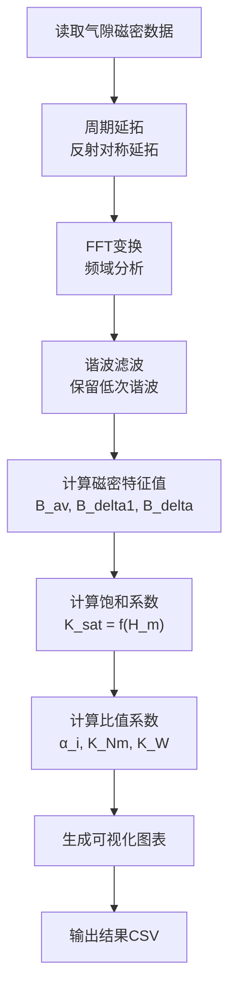
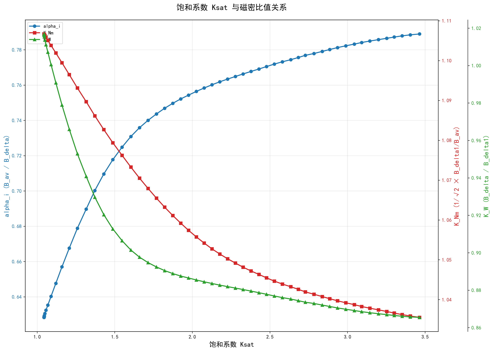
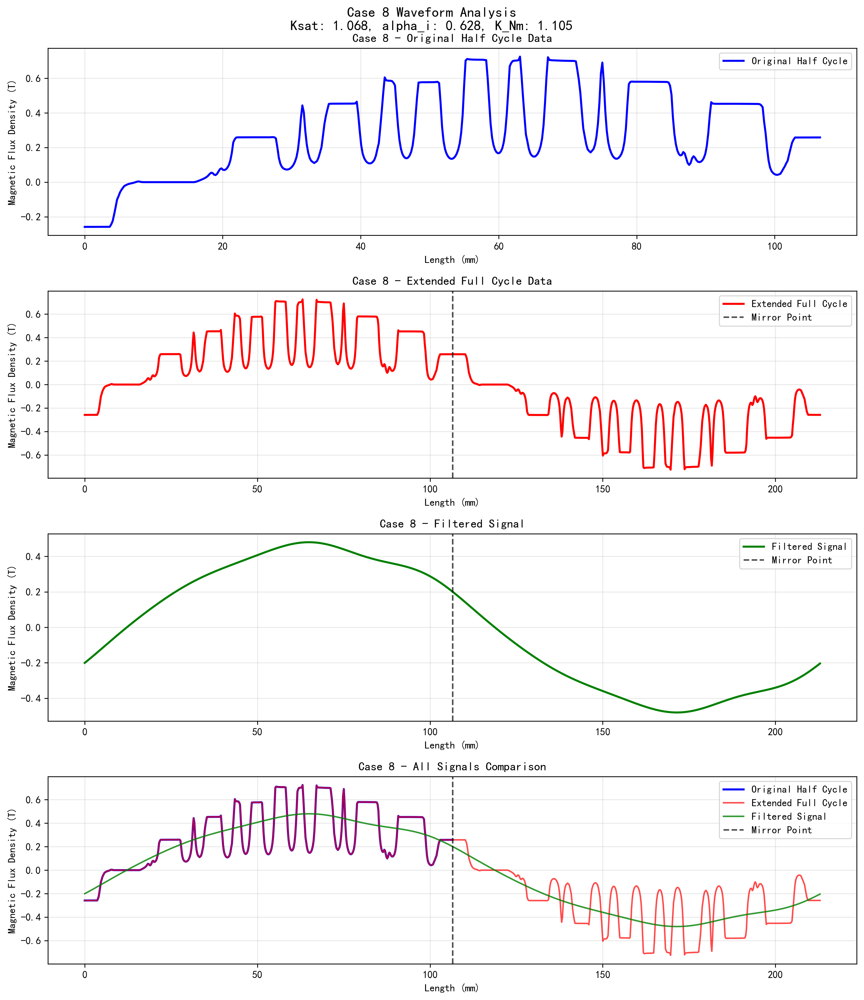

# 感应电机饱和系数计算与磁密分析

## 项目简介

本项目用于分析感应电机气隙磁密数据，计算饱和系数 **K_sat** 以及相关的磁密比值系数，包括极弧系数 **α_i**、波形系数 **K_Nm** 和绕组系数 **K_W**。通过FFT分析、谐波滤波等数字信号处理技术，提供完整的电机磁密特性分析。

## 核心功能

### 1. 饱和系数计算
- **K_sat = 1 + (H_m,dr × 23.6 + H_m,ds × 27) / (H_m,delta × 0.4)**
- 其中：
  - H_m,dr：转子齿部磁场强度 (A/m)
  - H_m,ds：定子齿部磁场强度 (A/m)
  - H_m,delta：气隙磁场强度 (A/m)
  - 23.6：转子齿高 (mm)
  - 27：定子齿高 (mm)  
  - 0.4：气隙长度 (mm)

### 2. 磁密比值系数计算

#### 极弧系数 α_i
- **α_i = B_av / B_delta**
- 其中：
  - B_av：完整周期气隙磁密绝对值平均值
  - B_delta：滤波后磁密幅值

#### 波形系数 K_Nm  
- **K_Nm = (1/√2) × (B_delta1 / B_av)**
- 其中：
  - B_delta1：FFT基波幅值

#### 绕组系数 K_W
- **K_W = B_delta / B_delta1**
- 表征谐波对气隙磁密的影响

### 3. 数字信号处理
- **周期延拓**：将半周期数据通过反射延拓为完整周期
- **FFT分析**：提取基波分量和高次谐波
- **谐波滤波**：保留低次谐波，消除高频噪声
- **磁场强度计算**：H = B / μ₀

## 项目结构

```
├── README.md                    # 项目说明文档
├── data_processor.py           # 核心数据处理模块
├── visualization.py            # 综合可视化模块
├── waveform_display.py         # 波形详细分析可视化
├── output_results/             # 输出结果目录
│   ├── complete_calculation_results.csv    # 完整计算结果
│   ├── ksat_ratios_table.csv              # 比值系数表格
│   ├── ksat_comprehensive.png             # 综合关系曲线图
│   ├── ksat_alpha_knm.png                 # K_sat与α_i、K_Nm关系图
│   ├── ksat_kw_curve.png                  # K_sat与K_W关系图
│   └── waveform_case_X.png                # 各案例波形分析图
├── prmtric.1/                  # 输入数据目录
│   ├── case.0/
│   │   ├── output.txt         # 磁场强度参数
│   │   └── airgapflux.csv     # 气隙磁密数据
│   ├── case.1/
│   └── ...
└── Ksat_curve/                 # 其他数据目录
```

## 数据处理流程



## 安装与使用

### 1. 环境准备
```bash
pip install pandas numpy matplotlib
```

### 2. 数据处理
```python
from data_processor import DataProcessor

# 创建处理器实例
processor = DataProcessor()

# 处理所有案例数据（使用5次谐波滤波）
processor.process_all_cases(harmonic_filter_n=5)

# 保存结果到CSV
processor.save_to_csv("motor_design_results.csv")
```

### 3. 生成可视化图表

#### 综合可视化（推荐）
```bash
python visualization.py
```
生成以下图表：
- `ksat_comprehensive.png`：K_sat与所有比值系数的综合关系图
- `ksat_alpha_knm.png`：K_sat与α_i、K_Nm的双轴关系图  
- `ksat_kw_curve.png`：K_sat与K_W的单独关系图

#### 波形分析
```bash
python waveform_display.py
```
生成指定案例的详细波形分析图，包含：
- 原始半周期数据
- 延拓后完整周期数据
- 滤波后信号
- 多信号对比图

## 输出结果

### 1. K_sat与比值系数关系曲线



**综合图表说明：**
- **蓝色曲线**：饱和系数K_sat与极弧系数α_i的关系
- **红色曲线**：饱和系数K_sat与波形系数K_Nm的关系  
- **绿色曲线**：饱和系数K_sat与绕组系数K_W的关系
- **横轴**：饱和系数K_sat
- **三个纵轴**：分别对应α_i、K_Nm、K_W

### 2. 典型案例波形分析



**波形分析包含四个子图：**
1. **原始半周期数据**：从仿真获得的气隙磁密分布
2. **延拓完整周期**：通过反射延拓得到的完整周期数据
3. **滤波后信号**：经过谐波滤波处理的平滑信号
4. **对比图**：三种信号的叠加对比

### 3. 数据表格

#### 主要结果表格 (`ksat_ratios_table.csv`)
包含各案例的K_sat、α_i、K_Nm、K_W值

#### 完整计算结果 (`complete_calculation_results.csv`)  
包含所有中间计算参数：
- 磁场强度：H_m,delta、H_m,dr、H_m,ds
- 磁密特征值：B_av、B_delta1、B_delta
- 最终系数：K_sat、α_i、K_Nm、K_W

## 技术特性

### 信号处理算法
- **周期延拓算法**：避免端点重复的反射对称延拓
- **FFT谐波分析**：提取各次谐波分量
- **低通滤波器**：可调节谐波截止次数
- **磁场强度转换**：B-H关系计算

### 数据可视化
- **多轴图表**：同时显示多个参数关系
- **中文字体支持**：完整的中文标签显示
- **高分辨率输出**：300 DPI图像质量
- **统一输出管理**：所有结果集中在output_results目录

### 数据处理特点
- **批量处理**：自动处理所有案例数据
- **错误处理**：数据缺失或格式错误的容错机制
- **参数可调**：谐波滤波次数等参数可配置
- **结果验证**：完整的中间计算结果保存

## 开发说明

### 主要模块

#### `data_processor.py`
- `CaseData`类：单个案例数据管理
- `DataProcessor`类：批量数据处理
- 核心算法：FFT分析、谐波滤波、系数计算

#### `visualization.py`  
- 综合可视化功能
- 多种图表类型生成
- 数据表格输出

#### `waveform_display.py`
- 详细波形分析
- 信号处理过程可视化
- 单案例深度分析

### 扩展功能
- 支持不同的谐波滤波策略
- 可添加其他磁密特征参数
- 支持批量案例对比分析
- 可扩展到其他类型电机分析

---